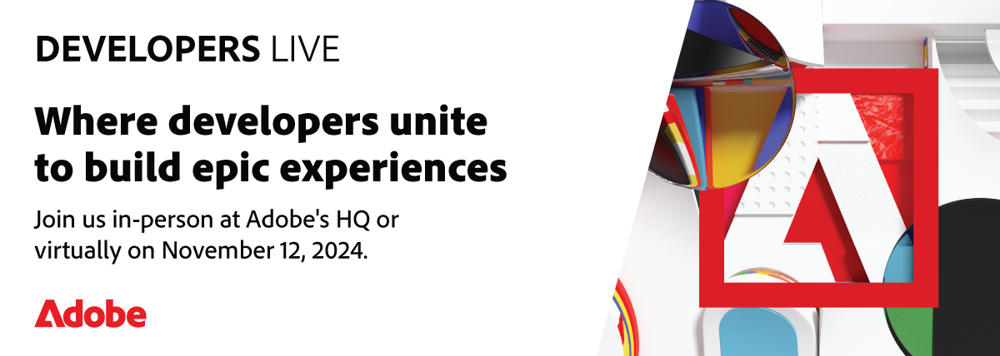

<TitleBlock slots="heading" theme="lightest" />

## Latest Developer News

<ResourceCard slots="link, image, heading, text" width="33%"  theme='lightest' className="useCaseCard" />

### Adobe Developers Live

Nov 12, 2024 | San Jose & Online  
Join AEM and Commerce developers for exclusive insights and innovations. Register now!

<ResourceCard slots="link, image, heading, text" width="33%"  theme='lightest' className="useCaseCard"/>

### Make building add-ons your superpower

Build add-ons to extend the functionality of Adobe Express and unlock new creative workflows for users.

<ResourceCard slots="link, image, heading, text" width="33%"  theme='lightest' className="useCaseCard" />

### Adobe MAX

Oct 14-16 Miami Beach and Online.  
Register Now.