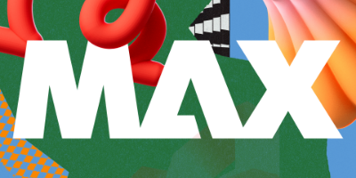

<TitleBlock slots="heading" theme="lightest" />

## Latest Developer News

<ResourceCard slots="link, image, heading, text" width="33%"  theme='lightest' className="useCaseCard"/>

### Adobe Max: The Creativity Conference

Explore and play with new creative tools, meet other passionate creatives, and be inspired at every turn. Join us in person or online.

<ResourceCard slots="link, image, heading, text" width="33%"  theme='lightest' className="useCaseCard" />

### Try App Builder for 30 days, free!!

Start building your custom cloud native Adobe app by signing up for our free trial program. Provide feedback to help shape the future of App Builder.

<ResourceCard slots="link, image, heading, text" width="33%"  theme='lightest' className="useCaseCard" />

### Extend the power of Adobe Express

Use web technologies like HTML, CSS and Javascript to build add-ons that unlock creative potential in new ways.