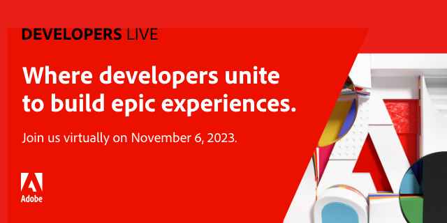

<TitleBlock slots="heading" theme="lightest" />

## Latest Developer News

<ResourceCard slots="link, image, heading, text" width="33%"  theme='lightest' className="useCaseCard index-adobe-developer-live"/>

### Adobe Developers Live

Adobe Developers Live brings together content and commerce developers with diverse backgrounds and a singular purpose – to create incredible end-to-end composable experiences using Edge Delivery services in Adobe Experience Manager and Adobe Commerce.

<ResourceCard slots="link, image, heading, text" width="33%"  theme='lightest' className="useCaseCard index-app-builder" />

### Try App Builder for 30 days for free

Start building your custom cloud native Adobe app by signing up for our free trial program.

<ResourceCard slots="link, image, heading, text" width="33%"  theme='lightest' className="useCaseCard index-express" />

### Extend the power of Adobe Express

Use web technologies like HTML, CSS and Javascript to build add-ons that unlock creative potential in new ways.