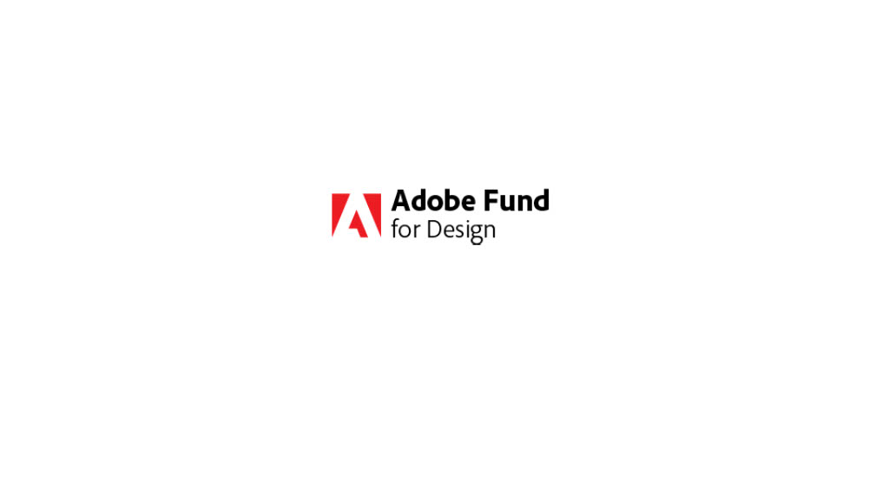
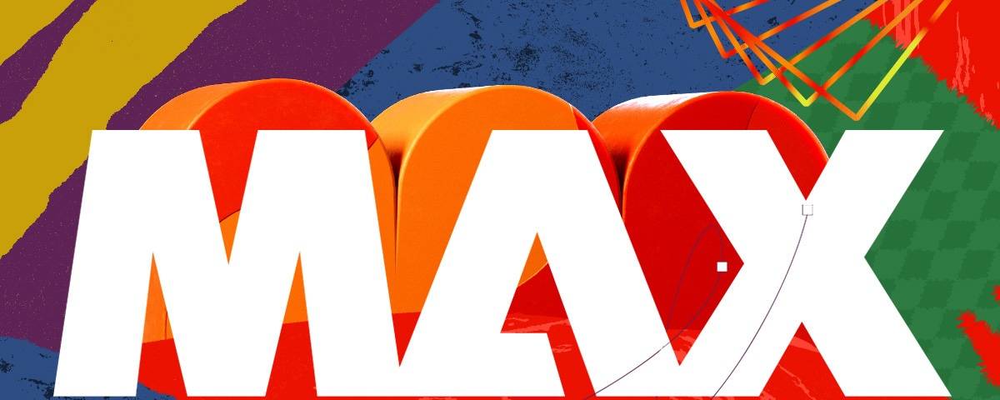

<TitleBlock slots="heading" theme="lightest" />

## Latest Developer News

<ResourceCard slots="link, image, heading, text" width="33%"  theme='lightest' className="useCaseCard"/>

### Adobe Developers Live

Join us June 19-20 for a 2-day virtual event for Adobe Express and Creative Cloud developers

<ResourceCard slots="link, image, heading, text" width="33%"  theme='lightest' className="useCaseCard" />

### Adobe Fund for Design

Get funding to build Adobe Express add-ons — plugins and integrations that unleash the creativity of millions of users.

<ResourceCard slots="link, image, heading, text" width="33%"  theme='lightest' className="useCaseCard" />

### Adobe MAX

Our creativity conference is Oct 14-16 in Miami Beach. Subscribe to our [newsletter](https://www.adobe.com/max.html#max-mailing-list) to be the first to know when registration opens in May.