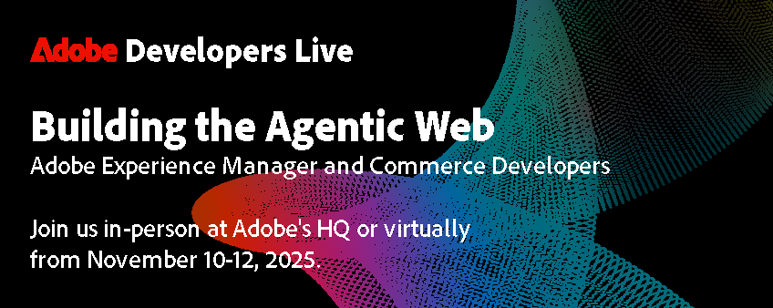
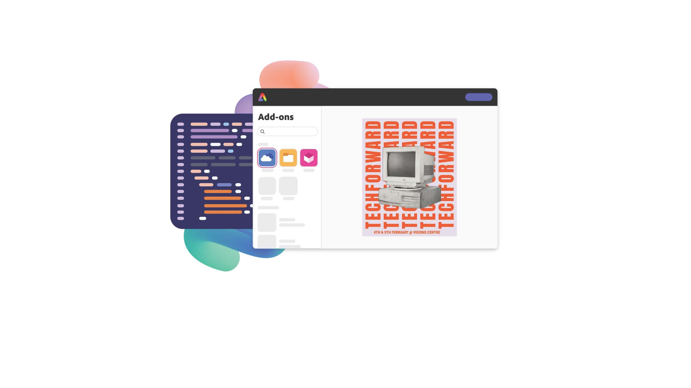

<TitleBlock slots="heading" theme="lightest" />

## Latest Developer News

<ResourceCard slots="link, image, heading, text" width="33%"  theme='lightest' className="useCaseCard" />

### Adobe Developers Live
  
Nov 10-12, 2025 | San Jose & Online  
Join AEM and Commerce developers to explore AI, extensibility, and Building the Agentic Web. Register now!

<ResourceCard slots="link, image, heading, text" width="33%"  theme='lightest' className="useCaseCard"/>

### Make building add-ons your superpower

Build add-ons to extend the functionality of Adobe Express and unlock new creative workflows for users.

<ResourceCard slots="link, image, heading, text" width="33%"  theme='lightest' className="useCaseCard" />

### Adobe Developers Live Replay

Watch the recordings from the Adobe Express and Creative Cloud Adobe Developers Live, our virtual conference we hosted June 24-25, 2025.