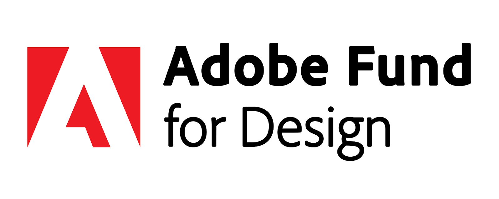

<TitleBlock slots="heading" theme="lightest" />

## Latest Developer News

<ResourceCard slots="link, image, heading, text" width="33%"  theme='lightest' className="useCaseCard" />

### Adobe Fund for Design

Get funding to build Adobe Express add-ons — plugins and integrations that unleash the creativity of millions of users.

<ResourceCard slots="link, image, heading, text" width="33%"  theme='lightest' className="useCaseCard"/>

### Make building add-ons your superpower

Build add-ons to extend the functionality of Adobe Express and unlock new creative workflows for users.

<ResourceCard slots="link, image, heading, text" width="33%"  theme='lightest' className="useCaseCard" />

### Adobe MAX

Oct 14-16 Miami Beach and Online.  
Register Now.